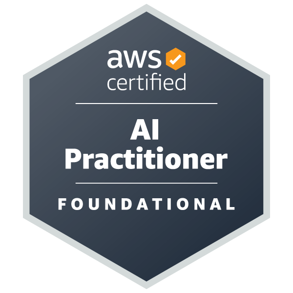
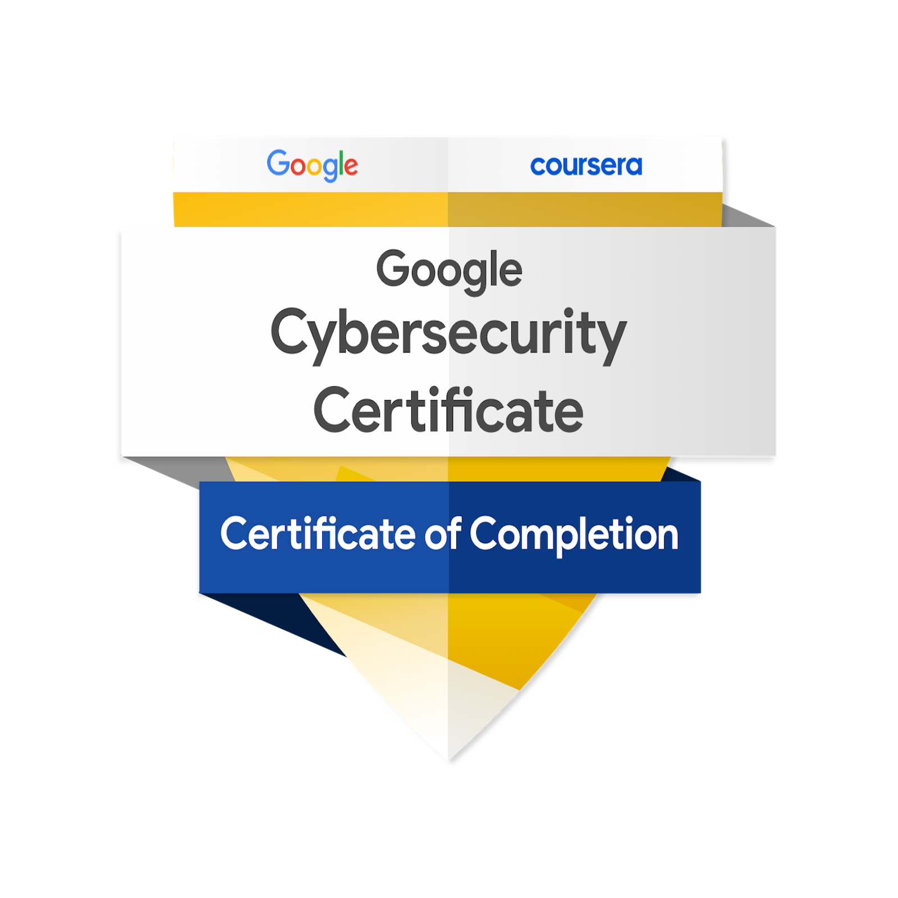

# Hi there! 👋 I'm Sarath Rajan Senthilkumar
A final-year Computer Science and Engineering (CSE) student at VIT Chennai, your friendly neighborhood Python Developer, an Intern at Virtusa, and a Global Affairs enthusiast. I'm passionate about crafting simple and practical solutions to complex problems. 

## About Me
I thrive in collaborative environments and enjoy leading teams with a positive and energetic approach. I believe that teamwork makes the dream work, and I strive to make every coding project an enjoyable and productive experience. I'm always eager to learn new technologies and explore different areas within the tech world.

## What I Do
I specialize in Python development, with a keen interest in Generative AI, Cybersecurity. My focus is on building impactful and user-friendly applications.

## Skills
* **Languages:** Python, SQL, HTML/CSS
* **Technologies/Frameworks:** Gradio, Gemini, FastAPI
* **Other:** Generative AI, Cybersecurity, Project Management, Data Engineering

## Currently Learning
I'm constantly exploring the latest advancements in Generative AI and Cybersecurity to further enhance my skillset.

## Connect with me
* **LinkedIn:** [https://www.linkedin.com/in/sarath-rajan-senthilkumar-496375240/](https://www.linkedin.com/in/sarath-rajan-senthilkumar-496375240/)
* **HuggingFace:** [https://huggingface.co/Sarathrsk03](https://huggingface.co/Sarathrsk03)
* **Google Scholar:** [https://scholar.google.com/citations?user=qCJa8BMAAAAJ&hl=en](https://scholar.google.com/citations?user=qCJa8BMAAAAJ&hl=en)

## Badges
 
